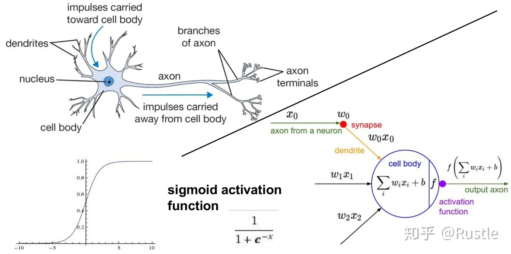

# 第一周

## 一、学习资源

* Python <https://www.python.org/>
* Anaconda <https://www.anaconda.com/>
* Github <https://github.com/>
* Kaggle <https://www.kaggle.com/>
* Colab  <https://colab.research.google.com/>
* huggingface <http://www.huggingface.co>
* arxiv.org <https://arxiv.org/>

## 二、认识神经网络

* <https://caigk.github.io/convnetjs/demo/classify2d.html>
* <https://caigk.github.io/playground>

通用逼近定理（ Universal Approximation Theorem, UAT）声明，只有一个有限层神经元的隐藏层足以逼近任何寻找的函数。
深度学习本质上就是一张很深、有很多层的神经网络，通过调整网络中每一个神经元的敏感程度，使得这个网络在接收不同刺激信号的时候激活不同的神经元，产生不同的反应。

## 三、自学视频课程




**知识点**：

| 1 | 2 | 3 | 4 | 5 |
| --- | ----------- | ----------- | ----------- | ----------- |
| 得分函数 | 损失函数 | 前向传播 | 返向传播 | 神经网络整体架构 |
| 神经元个数对结果的影响 | 正则化与激活函数 | 卷积神经网络 | 卷积的作用 |  |
| 残差网络 | RNN网络 |  |  |  |


## 四、源码

* [deep-learning-from-scratch](https://github.com/oreilly-japan/deep-learning-from-scratch)
* [deep-learning-from-scratch-2](https://github.com/oreilly-japan/deep-learning-from-scratch-2)
* [deep-learning-from-scratch-4](https://github.com/oreilly-japan/deep-learning-from-scratch-4)
* [deep-learning-from-scratch-5](https://github.com/oreilly-japan/deep-learning-from-scratch-5)
* [deep-learning-with-python-notebooks](https://github.com/caigk/deep-learning-with-python-notebooks)

## 五、安装python环境

请先安装*Anaconda* https://www.anaconda.com/

* [yolo](https://docs.ultralytics.com/models/)
* [yolo world](https://docs.ultralytics.com/models/yolo-world/)
* [yolov8s-world.pt](https://github.com/ultralytics/assets/releases/download/v8.2.0/yolov8s-world.pt)

```bash
#创建并激活环境
conda create -n myenv python=3.11 --yes
conda activate myenv

#安装jupyter
conda install jupyterlab --yes

#安装AI环境
conda install pytorch torchvision -c pytorch --yes
pip install ultralytics -i https://pypi.tuna.tsinghua.edu.cn/simple
pip install openai-clip -i https://pypi.tuna.tsinghua.edu.cn/simple

#安装标注软件
conda install labelme

#克隆 pytorch/tutorial.git
git clone git@github.com:pytorch/tutorials.git
#或 下面命令
#pip install labelme -i https://pypi.tuna.tsinghua.edu.cn/simple

#克隆 练习源码
git clone https://github.com/oreilly-japan/deep-learning-from-scratch.git
git clone https://github.com/caigk/deep-learning-with-python-notebooks.git

#使用yolo world 模型目标检测
#wget https://github.com/ultralytics/assets/releases/download/v8.2.0/yolov8s-world.pt
yolo predict model=path/to/yolov8s-world.pt source=path/to/tls-talk640.jpg imgsz=640

## Install all packages together using conda
#conda install -c pytorch -c nvidia -c conda-forge pytorch torchvision pytorch-cuda=11.8 ultralytics


```

## 六、安装IDE

* [VS CODE](https://code.visualstudio.com/)
* 安装扩展：ms-python.python，ms-python.debugpy

## 七、练习

1. 打开 deep-learning-from-scratch/notebooks/ch01.ipynb ...练习
1. 打开 deep-learning-with-python-notebooks/chapter02_mathematical-building-blocks.ipynb ...练习
1. 练习 yolo world
1. 练习 yolov8
1. 标注图片 labelme

## 八、测评

**使用yolov8模型对图像目标检测**

1. 自己整理图片100张
2. 使用labelme对图片进行标注
3. 将标注的图片整理为数据集（80张训练、20张测试）
4. 使用数据集对yolov8m进行训练
5. 使用yolo模型对目标检测

<!-- ## 加微信

 -->
