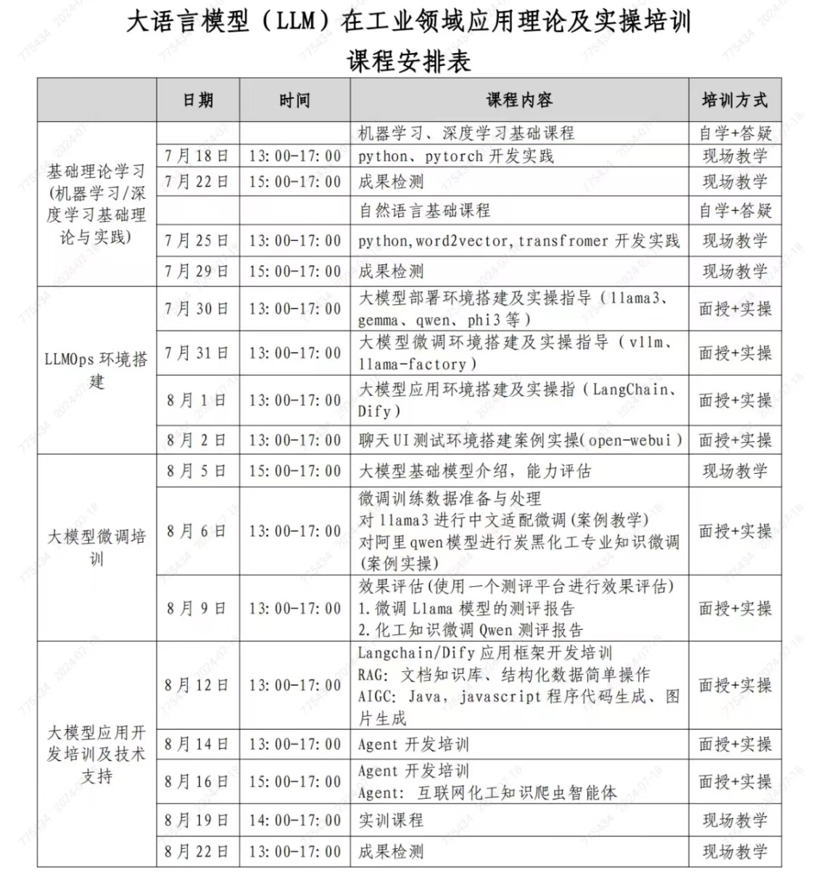

# 首页

## 一、学习资源

* Python <https://www.python.org/>
* Anaconda <https://www.anaconda.com/>
* Git <https://git-scm.com/downloads>
* Github <https://github.com/>
* Kaggle <https://www.kaggle.com/>
* Colab  <https://colab.research.google.com/>
* huggingface <http://www.huggingface.co>
* arxiv.org <https://arxiv.org/>

## 二、课程表

## 三、加微信

