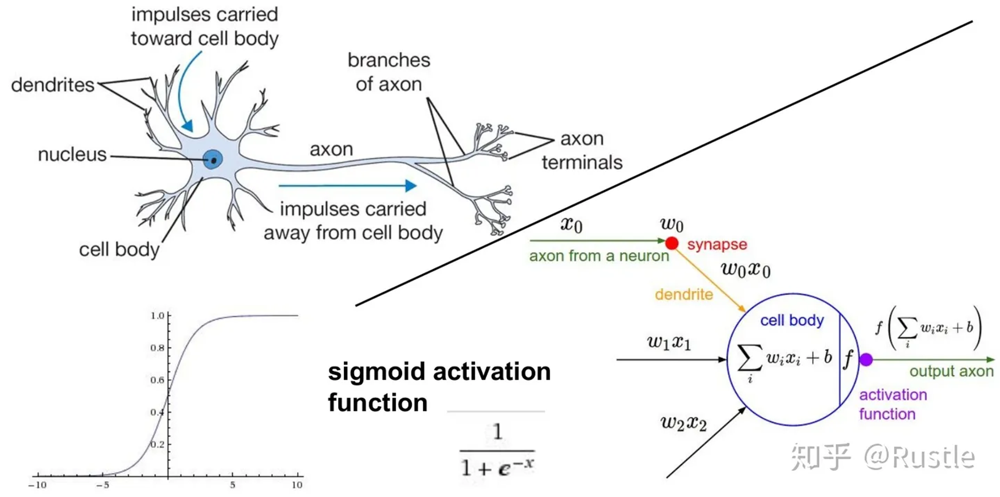

# python、pytorch 开发实践

!> 请先观看**教学视频**，视频请在培训群中索取

## 一、学习资源

* **Python** <https://www.python.org/>
* **Jupyter** <https://jupyter.org/>
* **Anaconda** <https://www.anaconda.com/>
* **Git** <https://git-scm.com/downloads>
* **Github** <https://github.com/>
* **Kaggle** <https://www.kaggle.com/>
* **Colab**  <https://colab.research.google.com/>
* **huggingface** <http://www.huggingface.co>
* **arxiv.org** <https://arxiv.org/>

* [cuda-toolkit-archive](https://developer.nvidia.com/cuda-toolkit-archive)

**论文**

* 🌷[You Only Look Once: Unified, Real-Time Object Detection](papers/arxiv.org.abs.1506.02640v5.pdf ':ignore')
* [A COMPREHENSIVE REVIEW OF YOLO ARCHITECTURES IN COMPUTER VISION: FROM YOLOV1 TO YOLOV8 AND YOLO-NAS](papers/arxiv.org.pdf.2304.00501v7.pdf ':ignore')
* 🌷[DETRs Beat YOLOs on Real-time Object Detection](papers/arxiv.org.pdf.2304.08069v3.pdf ':ignore') 202404

## 二、认识神经网络

* <https://caigk.github.io/convnetjs/demo/classify2d.html>
* <https://caigk.github.io/playground>

通用逼近定理（ Universal Approximation Theorem, UAT）声明，只有一个有限层神经元的隐藏层足以逼近任何寻找的函数。
深度学习本质上就是一张很深、有很多层的神经网络，通过调整网络中每一个神经元的敏感程度，使得这个网络在接收不同刺激信号的时候激活不同的神经元，产生不同的反应。

## 三、自学视频课程

* 视频请在培训群中索取




**知识点**：

| 1 | 2 | 3 | 4 | 5 |
| --- | ----------- | ----------- | ----------- | ----------- |
| 得分函数 | 损失函数 | 前向传播 | 返向传播 | 神经网络整体架构 |
| 神经元个数对结果的影响 | 正则化与激活函数 | 卷积神经网络 | 卷积的作用 |  |
| 残差网络 | RNN网络 |  |  |  |

## 四、源码

* 《深度学习入门：基于Python的理论与实现》 斋藤康毅 🗂️源码：[gitee](https://gitee.com/mirrors_oreilly-japan/deep-learning-from-scratch)  [github](https://github.com/oreilly-japan/deep-learning-from-scratch)
* 《深度学习进阶：自然语言处理》 斋藤康毅 🗂️源码：[gitee](https://gitee.com/mirrors_oreilly-japan/deep-learning-from-scratch-2)  [github](https://github.com/oreilly-japan/deep-learning-from-scratch-2)
* 《深度学习入门：自制框架》 斋藤康毅 🗂️源码：[gitee](https://gitee.com/mirrors_oreilly-japan/deep-learning-from-scratch-3)  [github](https://github.com/oreilly-japan/deep-learning-from-scratch-3)
* 《深度学习进阶：强化学习》 斋藤康毅 🗂️源码：[gitee](https://gitee.com/caigk/deep-learning-from-scratch-4)  [github](https://github.com/oreilly-japan/deep-learning-from-scratch-4)
<!-- * 《深度学习：生成神经网格》 斋藤康毅 🗂️源码：[gitee](https://gitee.com/mirrors_oreilly-japan/deep-learning-from-scratch-5)  [github]( https://github.com/oreilly-japan/deep-learning-from-scratch-5) -->
* 《Python深度学习2》 Franc·ois Chollet 🗂️源码：[gitee](https://gitee.com/caigk/deep-learning-with-python-notebooks)  [github](https://github.com/caigk/deep-learning-with-python-notebooks)

## 五、安装python环境

请先安装*Anaconda* https://www.anaconda.com/

```bash
#创建并激活环境
conda create -n myenv python=3.11 --yes
conda activate myenv

#安装jupyter
conda install jupyterlab --yes
#启动,注意当前目录为工作目录，你可以进行目录在启动
jupyter lab

#或安装
conda install notebook --yes
#pip install notebook -i https://pypi.tuna.tsinghua.edu.cn/simple
#启动
jupyter notebook

#安装AI环境
conda install pytorch torchvision -c pytorch --yes
pip install ultralytics -i https://pypi.tuna.tsinghua.edu.cn/simple
pip install openai-clip -i https://pypi.tuna.tsinghua.edu.cn/simple

#安装标注软件
conda install labelme

#克隆 pytorch/tutorial.git
git clone git@github.com:pytorch/tutorials.git
#或 下面命令
#pip install labelme -i https://pypi.tuna.tsinghua.edu.cn/simple

#使用yolo world 模型目标检测
#wget https://github.com/ultralytics/assets/releases/download/v8.2.0/yolov8s-world.pt
yolo predict model=path/to/yolov8s-world.pt source=path/to/tls-talk640.jpg imgsz=640

## Install all packages together using conda
#conda install -c pytorch -c nvidia -c conda-forge pytorch torchvision pytorch-cuda=11.8 ultralytics


```

## 六、安装IDE

!> 为了统一授课，统一采用VS CODE作为开发练习平台

* [VS CODE](https://code.visualstudio.com/)

```bash
#命令行安装
code --install-extension ms-python.python --force
code --install-extension ms-python.debugpy --force
code --install-extension ms-toolsai.jupyter --force
code --install-extension ms-toolsai.vscode-jupyter-slideshow --force
code --install-extension ms-toolsai.jupyter-keymap --force
code --install-extension ms-toolsai.jupyter-renderers --force
code --install-extension ms-toolsai.vscode-jupyter-cell-tags --force

#code --list-extensions
```

## 七、练习

**参考**

* [yolo](https://docs.ultralytics.com/models/)
* [yolo world](https://docs.ultralytics.com/models/yolo-world/)
* [yolov8s-world.pt](https://github.com/ultralytics/assets/releases/download/v8.2.0/yolov8s-world.pt)

1. 打开 deep-learning-from-scratch/notebooks/ch01.ipynb ...练习
1. 打开 deep-learning-with-python-notebooks/chapter02_mathematical-building-blocks.ipynb ...练习
1. 练习 yolo world
1. 练习 yolov8
1. 标注图片 labelme

## 八、测评

**使用yolov8模型对图像目标检测**

1. 自己整理图片100张
2. 使用labelme对图片进行标注
3. 将标注的图片整理为数据集（80张训练、20张测试）
4. 使用数据集对yolov8m进行训练
5. 使用yolo模型对目标检测
