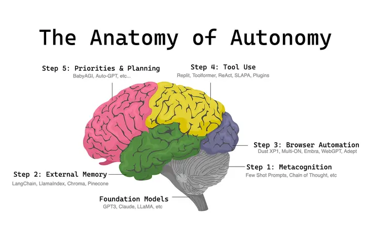

# 大模型应用开发agent

## 一、学习资源

* [llama-cpp-agent github](https://github.com/Maximilian-Winter/llama-cpp-agent)
* [OpenAgents github](https://github.com/xlang-ai/OpenAgents) 📄[paper](spapers\agent\arxiv.org.pdf.2310.10634v1.pdf ':ignore') 
* [camel-ai.org](https://www.camel-ai.org/)
* [camel github](https://github.com/camel-ai/camel)  📄[paper](papers\agent\arxiv.org.pdf.2303.17760v2.pdf ':ignore') 
* [AutoGPT github](https://github.com/Significant-Gravitas/AutoGPT)💯
* [babyagi github](https://github.com/yoheinakajima/babyagi)
* [小镇](https://github.com/joonspk-research/generative_agents)
* [agents github](https://github.com/aiwaves-cn/agents) Agents 2.0: Symbolic Learning Enables Self-Evolving Agents
* [Building LLM applications for production](https://huyenchip.com/2023/04/11/llm-engineering.html)

**论文**

* [An LLM Compiler for Parallel Function Calling](papers\agent\arxiv.org.pdf.2312.04511v3.pdf ':ignore')
* [Describe, Explain, Plan and Select: Interactive Planning with Large Language Models Enables Open-World Multi-Task Agents](papers\agent\Describe_Explain_Plan_and_Select_Interactive_Plann.pdf ':ignore')



## 二、langchain中agent实现

### 动作代理人（Action agents）

在每个时间步上，使用所有先前动作的输出决定下一个动作。

1. 接收用户输入
1. 决定是否使用任何工具以及工具输入
1. 调用工具并记录输出（也称为“观察结果”）
1. 使用工具历史记录、工具输入和观察结果决定下一步
1. 重复步骤 3-4，直到确定可以直接回应用户

| type | 说明 |
| ---- | ------- |
| zero-shot-react-description |	代理使用ReAct框架，仅基于工具的描述来确定要使用的工具.此代理使用 ReAct 框架确定使用哪个工具 仅基于工具的描述。缺乏 会话式记忆。 |
| conversational-react-description |		这个代理程序旨在用于对话环境中。提示设计旨在使代理程序有助于对话。 它使用ReAct框架来决定使用哪个工具，并使用内存来记忆先前的对话交互。 |
| react-docstore |		这个代理使用ReAct框架，必须提供两个工具：一个Search工具和一个Lookup工具自问自答，会使用Google搜索工具。 |
| self-askwith-search |		代理使用一个被命名为Intermediate Answer的工具。根据需要执行搜索和提问步骤，以获得最终答案。 |
| chat-zero-shot-react-description |		zero-shot意味着代理 (Agents) 仅在当前操作上起作用——它没有 记忆。 |
| chat-conversational-react-description |		该代理被设计用于会话设置。提示的目的是使代理具有帮助和会话性。它使用ReAct框架来决定使用哪个工具，并使用内存来记住以前的会话交互。 |
| structured-chat-zero-shot-react-description |		能够使用多输入工具，结构化的参数输入。 |
| openai-functions |		某些OpenAI模型（如gpt-3.5-turbo-0613和gpt-4-0613）已经明确地进行了微调，如果使用这些模型，可以考虑使用OpenAI Functions 的AgentType。 |
| openai-multi-functions |		某些OpenAI模型（如gpt-3.5-turbo-0613和gpt-4-0613）已经明确地进行了微调，如果使用这些模型，可以考虑使用OpenAI Functions 的AgentType。 |

### 计划执行代理人（Plan-and-execute agents）
预先决定所有动作的完整顺序，然后按照计划执行，而不更新计划。

1. 接收用户输入
1. 规划要执行的全部步骤序列
1. 按顺序执行步骤，将过去步骤的输出作为未来步骤的输入


## 三、ollama模拟openai

### 1.拉取模型
```bash
ollama pull llama3.1

```

### 2.建立modelfile文件


```bash
vi gpt-3.5-turbo-16k.modelfile

#####
FROM llama3.1
# sets the temperature to 1 [higher is more creative, lower is more coherent]
PARAMETER temperature 0.7
# sets the context window size to 4096, this controls how many tokens the LLM can use as context to generate the next token
PARAMETER num_ctx 4096

# sets a custom system message to specify the behavior of the chat assistant
SYSTEM You are Mario from super mario bros, acting as an assistant.

```

### 3.创建模型

```bash
ollama create gpt-3.5-turbo-16k --file gpt-3.5-turbo-16k.modelfile
```

### 4.导入环境变量
```bash
#bash
OPENAI_API_BASE=http://ai.baitech.com.cn:9901/v1
OPENAI_API_KEY=ollama
```

```bat
REM command
set BASE_URL=http://ai.baitech.com.cn:9901/v1
set OPENAI_API_KEY=ollama
```

```powershell
#powershell
$env:BASE_URL="http://ai.baitech.com.cn:9901/v1"
$env:OPENAI_API_KEY="ollama"
```


## 四、camel
```bash
$env:OPENAI_API_BASE_URL="http://ai.baitech.com.cn:9901/v1"
$env:OPENAI_API_KEY="ollama"

# Clone github repo
git clone -b v0.2.0 https://github.com/camel-ai/camel.git

# Change directory into project directory
cd camel

# Create a conda virtual environment
conda create -p .conda  python=3.10

# Activate CAMEL conda environment
conda activate ./.conda

# Install CAMEL from source
pip install -e .

# Or if you want to use all other extra packages
pip install -e .[all] # (Optional)

```

```bash
#顶部加入
#修改为OLLAMA
from camel.models.model_factory import ModelFactory
from camel.types.enums import ModelPlatformType
ollama_model = ModelFactory.create(
    model_platform=ModelPlatformType.OLLAMA,
    model_type="llama3.1",
    url="http://ai.baitech.com.cn:9901/v1",
    model_config_dict={"temperature": 0.4},
)

#尾部修改
main(model=ollama_model)

#运行
python examples\single_agent.py


python examples\ai_society\role_playing.py

```

## 五、ChatDev

