# 小目标检测

!> 小目标检测是计算机视觉领域中的一个极具挑战性的问题。随着深度学习和计算机视觉领域的不断发展，越来越多的应用场景需要对小目标进行准确的检测和识别。

## 一、学习资源

* [YOLOv5改进（一）轻量化YOLOv5s模型](https://blog.csdn.net/qq_44231797/article/details/137443386)
* [YOLOv5改进（二）目标检测优化点（添加小目标头检测）](https://blog.csdn.net/qq_44231797/article/details/137729312) 💯
* [YOLO算法模型yaml文件史上最详细解析与教程](https://yolov5.blog.csdn.net/article/details/124695537)
* [数据增强albumentations](https://albumentations.ai/) [demo](https://demo.albumentations.ai/)

**📃论文**

* 📃 [AYN: Lightweight Multi-Scale Attention YOLOv8 Network for Small Object Detection](papers/sod/LAYN_Lightweight_Multi-Scale_Attention_YOLOv8_Network_for_Small_Object_Detection.pdf ':ignore')   💯
* 📃 [YOLO-S: A Lightweight and Accurate YOLO-like Network for Small Target Detection in Aerial Imagery](papers/sod/mdpi.com.sensors-23-01865-v3.pdf ':ignore')   💯
* 📃 [YOLO-Z: Improving small object detection in YOLOv5 for autonomous vehicles](papers/sod/arxiv.org.pdf.2112.11798v4.pdf ':ignore')   💯
* 📃 [TinyDet: Accurate Small Object Detection in Lightweight Generic Detectors](papers/sod/arxiv.org.pdf.2304.03428v1.pdf ':ignore')   💯
* 📃 [YOLO-Drone:Airborne real-time detection of dense small objects from high-altitude perspective](papers/sod/YOLO-DroneAirborne_real-time_detection_of_dense_sm.pdf ':ignore') 202304 💯
* 📃 [Towards Large-Scale Small Object Detection: Survey and Benchmarks](papers/sod/arxiv.org.pdf.2207.14096v4.pdf ':ignore')   💯
* 📃 [TPH-YOLOv5: Improved YOLOv5 Based on Transformer Prediction Head for Object Detection on Drone-captured Scenarios](papers/sod/arxiv.org.pdf.2108.11539v1.pdf ':ignore')   💯
* 📃 [Small-Object Detection in Remote Sensing Images with End-to-End Edge-Enhanced GAN and Object Detector Network](papers/sod/arxiv.org.pdf.2003.09085v5.pdf ':ignore')   💯
* 📃 [Augmentation for small object detection](papers/sod/arxiv.org.pdf.1902.07296v1.pdf ':ignore')  

**经典网络架构**

* **Alexnet:** Advances in Neural Information Processing Systems 25 (NIPS 2012) 卷积核大  
* **Vgg:** 小卷积核 
* **Resnet:** 解决深度问题  
* **U-net:** U-Net: Convolutional Networks for Biomedical Image Segmentation  编码解码+特征融合    
* **U-net ++:** A Nested U-Net Architecture for Medical Image Segmentation  dense特征融合    
* **Inception:** Rethinking the Inception Architecture for Computer Vision 
* **SqueezeNet:** ALEXNET-LEVEL ACCURACY WITH 50X FEWER PARAMETERS AND <0.5MB MODEL SIZE  
* **DenseNet:** Densely Connected Convolutional Networks    

## 二、背景

### 定义

小目标检测广义是指在图像中检测和识别尺寸较小、面积较小的目标物体。通常来说，小目标的定义取决于具体的应用场景，但一般可以认为小目标是指尺寸小于  像素的物体，如下图 COCO 数据集的定义。当然，对于不同的任务和应用，小目标的尺寸和面积要求可能会有所不同。
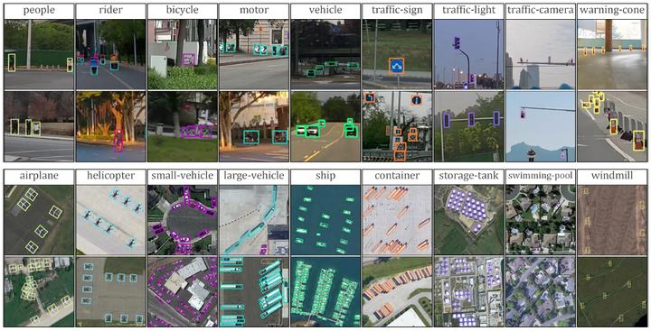
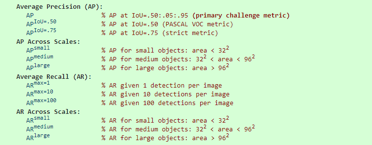

> 在 COCO 数据集中，针对三种不同大小(small，medium，large)的图片提出了测量标准，其包含大约 41% 的小目标(area<32×32), 34% 的中等目标(32×32<area<96×96), 和 24% 的大目标(area>96×96)。其中，小目标的 AP 是很难提升的！

### 意义

小目标检测的意义在于它可以提高技术的应用范围，同时可以帮助大家更好地理解图像中的细节信息。此外，小目标检测其实在我们日常生活中的许多领域均有广泛的应用，例如交通监控、医学影像分析、无人机航拍等。举个例子：

* 在交通监控领域，小目标检测可用于识别交通信号灯、车牌等。
* 在医学影像分析领域，小目标检测可用于识别微小的肿瘤细胞等。
* 在自动驾驶领域，小目标检测可用于识别微小的障碍物，以弥补激光雷达难以探测的窘况。

### 挑战

做过检测任务的同学应该很清楚这一点，那便是小目标检测其实一直是一个极具挑战性的问题。下面随便举几个小例子给大家感受下：

1. 小目标通常在图像中占据很小的区域，深度学习算法其实很难提取到有效的信息，更别提传统的特征提取方法。举个例子，对于一个室内会议场景，假设我们的摄像头装在左上角的上方区域，如果此时你训练完一个检测模型应用上去，会观察到在远离镜头的对角线区域其检测效果相对其它区域来说一般会差很多的，特别容易造成漏检和误检。
2. 小目标并不具备常规尺寸目标的纹理、颜色等丰富的细节特征，这使得小目标的检测更加困难，而且容易被模型误认为是“噪声点”。
3. 小目标其实有时候不好定义，以最简单的行人和车辆为例，不妨看下面这张图片：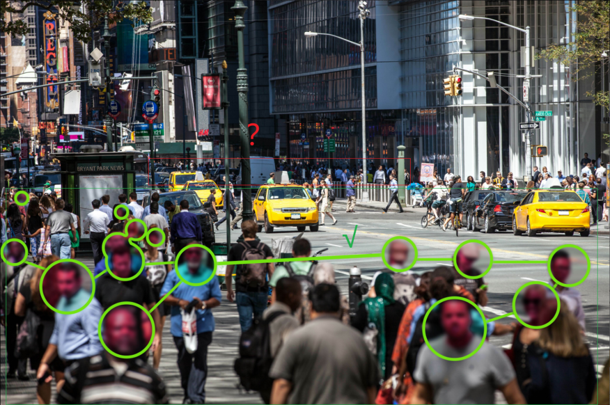大致划分了下，其中绿色框范围的目标其实是很容易标注的，主要是红色方框范围内的目标。大部分目标像素占比很小，标也不是，不标也不是，当然你可以采用ignore标签不计算损失或者干脆直接将这块区域mask掉，但现实就是很多情况下这种“小目标”其实很大概率会被漏打标，太多的话很容易造成训练曲线“抖动”。

## 三、解决方案

需要注意的是，双阶段目标检测算法由于存在RoI Pooling之类的操作, 因此小目标的特征会被放大，其特征轮廓也更为清晰，因此检出率通常也会更高。但本文还是主要围绕发展比较成熟的单阶段目标检测算法展开。

### 增大输入图像分辨率

图像分辨率，当之无愧是最大的罪魁祸首，想象一下，一张图像如果分辨率太小，假设我们就下采样32倍，理论上小于这个像素的目标信息基本就会完全丢失。因此，当处理小目标检测时，由于目标物体尺寸过小，通常需要将输入图像的分辨率提高，以便更好地捕捉目标的细节。通过提升输入图像分辨率，可以提高小目标检测的准确性和召回率，从而更好地识别和跟踪目标物体。

### 增大模型输入尺寸

图像缩放是另一种常用的解决方案，同样可以提高小目标检测的精度。常见的做法便是直接开启“多尺度训练”，设置比较大的尺寸范围。不过，增大模型输入尺寸可能会导致模型计算量的增加和速度的降低。因此，大家在使用时需要权衡精度和效率之间的平衡。通常需要根据实际需求和可用资源进行调整，以找到最佳的模型输入尺寸。

同样地，在推理时也可以视情况开启测试时增强Test Time Augmentation, TTA，特别是打比赛的时候。

### 特征融合

由于小目标的尺寸较小，其特征信息往往分布在图像的多个尺度中，因此需要在多个尺度的特征图中进行融合，以提高模型对小目标的感知能力。常见的多尺度特征融合方法包括 Feature Pyramid Networks, FPN 和 Path Aggregation Network, PAN 等。

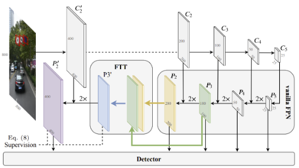

### 长跳跃连接

长跳跃连接是指将不同层级的特征图进行融合的一种方法，可以帮助模型更好地捕捉不同层级的特征信息。众所周知，浅层特征图的细节信息丰富但语义信息较弱，深层特征图则与之相反。因此，在小目标检测中，可以将低层级的特征图和高层级的特征图进行融合，以增强对小目标的定位能力。

### 注意力机制

注意力机制是一种能够将模型的注意力集中到重要区域的技术，可以通过对特征图进行加权处理，将更多的注意力集中到小目标所在的区域，从而提高对小目标的检测能力。常见的注意力机制包括SENet、SKNet等。

### 数据增强

数据增强是在保持数据本身不变的前提下，通过对数据进行随机变换来增加数据样本的数量和多样性，从而提高模型的泛化能力和鲁棒性。对于小目标检测任务，数据增强可以通过以下几种方式来解决：

* **尺度变换**:对于小目标而言，其尺寸往往较小，因此可以通过对原始图像进行缩放或放大的操作来增加数据样本的尺度变化。例如，可以将原始图像缩小一定比例，从而得到多个尺寸较小的图像样本。
* **随机裁剪**:对于包含小目标的图像，在不改变目标位置的情况下，可以通过随机裁剪的方式得到多个不同的图像样本，以增加数据的多样性。此外，可以使用非矩形的裁剪方式，例如多边形裁剪，来更好地适应小目标的不规则形状。
* **高级组合**:这一块大家伙最熟悉的可能是 YOLO 中的 Mosaic 增强，其由多张原始图像拼接而成，这样每张图像会有更大概率包含小目标。此外，我们还可以通过诸如 Copy-Paste 的办法将各类小目标充分的“复制-黏贴”，从而增加小目标的“曝光度”，提升他们被检测的概率。

### 大图切分

#### Tiling

Tiling是一种对大图进行切分的有效预处理操作，上图为在Roboflow平台上的演示。通过tile可以有效地让目标检测网络更好的聚焦在小物体上，同时允许我们保持所需的小输入分辨率，以便能够运行快速推断。不过需要注意的是，在推理时也理应保持输入的一致性。

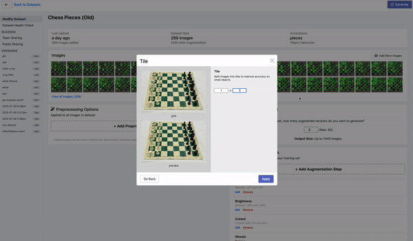

#### SAHI - Slicing Aided Hyper Inference

Tiling 算是比较老旧的技术，目前笔者强烈推荐的还是Slicing Aided Hyper Inference, SAHI，即切片辅助超级推理，是一个专用于小目标检测的推理框架，理论上可以集成到任意的目标检测器上，无需进行任何微调。该方法目前已被多个成熟的目标检测框架和模型集成进去，如YOLOv5、Detectron2和MMDetection等。

### 损失函数

#### 加权求和

这个非常好理解，就是我们可以自行定义小目标检测的尺寸，由于我们有 GT，因此在计算 Loss 的时候可以人为地对小目标施加更大的权重，让网络更加关注这部分。

### Stitcher

Stitcher是早几年出的产物，其出自《Stitcher: Feedback-driven Data Provider for Object Detection》一文。作者通过统计分析观察到，小目标之所以检测性能很差是因为在训练时对损失的贡献很小（要么漏检要么漏标）。因此，文章中提出了一种基于训练时动态反馈的机制，即根据计算出来的损失，自动决定是否要进行图像拼接的操作。

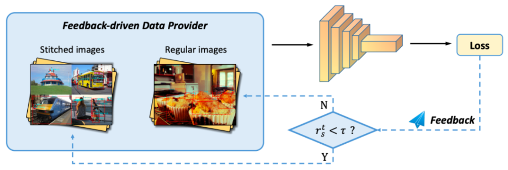

## 四. 小目标检测高效解决方案汇总

### 基于特征金字塔

#### 1.FPN：Feature Pyramid Networks for Object Detection

**标题：目标检测的特征金字塔网络**

**方法介绍**：Feature pyramids(特征金字塔)是检测不同尺度目标的识别系统中的基本组件。但是近年的基于深度学习的目标检测器避免了使用金字塔表示，部分原因是其计算和内存密集。本文利用深度卷积网络固有的多尺度金字塔层次结构，以边缘额外成本构建特征金字塔。作者开发了一个顶端下采样带侧向连接的架构来构建所有尺度的高级语义特征图。该架构称为特征金字塔网络(FPN)，作为通用特征提取器在多个应用中显示显著改进。

#### 2.RetinaFace: Single-stage Dense Face Localisation in the Wild

**RetinaFace：野外环境下的单阶段密集人脸定位**

**方法介绍**：本文提出了一种稳健的单阶段人脸检测器RetinaFace，采用轻量级网络，在单CPU核上对VGA分辨率图像进行实时处理，它通过联合额外的监督和自监督的多任务学习，在不同尺度的人脸上进行像素级人脸定位。在WIDER FACE困难测试集上，RetinaFace的平均精度比最先进的方法提高了1.1%。在IJB-C测试集上，RetinaFace使最先进的ArcFace方法在人脸验证中进一步提高了性能。

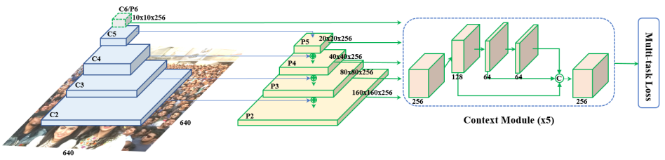

#### 3.SSH: Single Stage Headless Face Detector

**标题：单阶段无头人脸检测器**

**方法介绍**：作者提出了单阶段无头人脸检测器(SSH)。与两阶段的提议-分类检测器不同，SSH直接从分类网络的早期卷积层单阶段检测人脸。SSH是无头的，也就是说在移除基础分类网络的“头部”(即VGG-16中的全连接层，包含大量参数)的情况下，仍能达到最先进的结果。此外，SSH通过设计是尺度不变的，而非依赖图像金字塔来检测不同尺度的人脸。

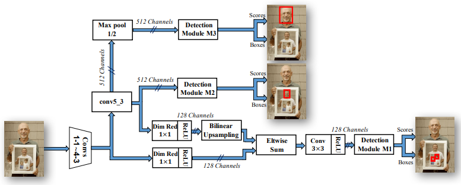

### FPN魔改版

#### 1、Path aggregation network for instance segmentation CVPR 2018

**标题：实例分割的路径聚合网络**

**方法介绍**：本文提出了路径汇聚网络(PANet)，旨在增强基于提议的实例分割框架中的信息流动。具体来说，通过自底向上的路径增强，使用下层的精确定位信号增强整个特征层次。作者提出自适应特征池化，将特征网格与所有特征级别连接，使每个特征级别中的有用信息直接传播到后续提议子网络，还为每个提议创建了一个补充分支，以捕获不同视角，进一步改善蒙版预测。这些改进很容易实现，计算开销很小。

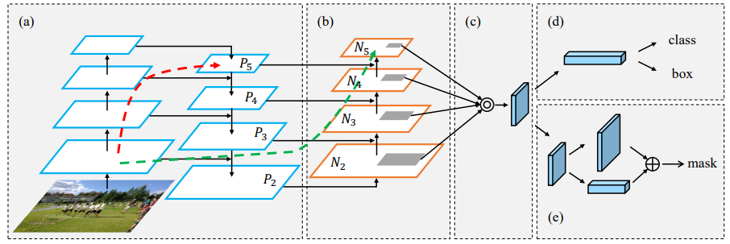

#### 2、Augfpn: Improving multi-scale feature learning for object detection CVPR 2020

**标题：增强多尺度特征学习以改进目标检测的AugFPN**

**方法介绍**：本文首先分析了FPN中特征金字塔的设计缺陷，然后提出了一种新的特征金字塔架构AugFPN来解决这些问题。具体而言，AugFPN由三个组件组成：一致的监督、残差特征增强和软RoI选择。在特征融合之前，一致的监督通过缩小不同尺度特征之间的语义鸿沟。在特征融合中，残差特征增强提取比例不变的上下文信息，以减少最高金字塔层特征图的信息损失。最后，软RoI选择用于在特征融合之后自适应地学习更好的RoI特征。

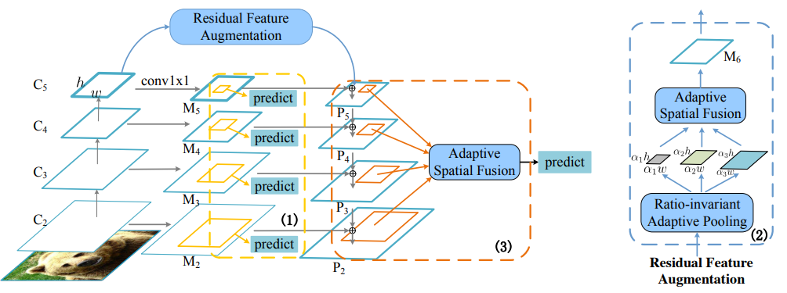

#### 3、Effective fusion factor in fpn for tiny object detection WACV 2021

**标题：FPN中有效的融合因子用于小目标检测**

**方法介绍**：本文认为，FPN中相邻层之间的自顶向下连接对小目标检测有两面影响，不仅是正面。作者提出了一个新概念“融合因子”，来控制深层向浅层传递的信息量，以使FPN适应小目标检测。经过一系列实验和分析，作者通过统计方法为特定数据集探索如何估计有效的融合因子值。该估计取决于每个层中目标分布的数量。作者在小目标检测数据集(如TinyPerson和Tiny CityPersons)上进行了全面的实验。结果表明，当用适当的融合因子配置FPN时，网络能在小目标检测数据集上获得显著的性能提升。

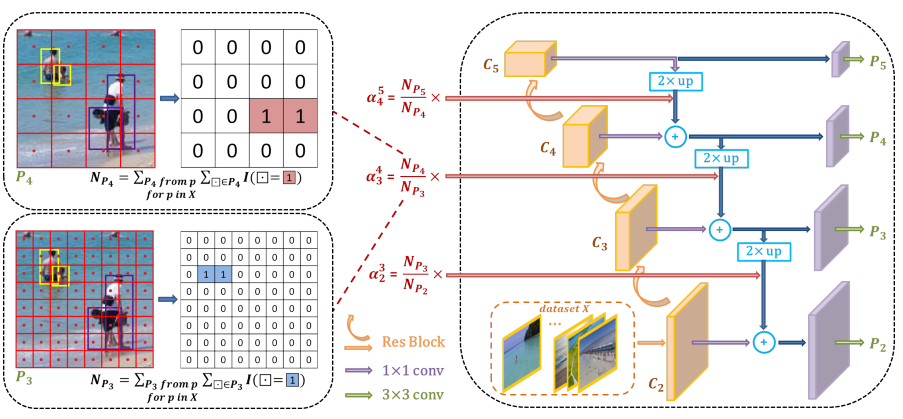

### 基于感受野

#### 1、Scale-Aware Trident Networks for Object Detection ICCV 2019

**标题：面向尺度的三叉网络用于目标检测**

**方法介绍**：在这项工作中，作者首先进行了一个受控实验，以研究感受野对目标检测中尺度变化的影响。基于探索性实验的发现，作者提出了一个新颖的三叉网络(TridentNet)，旨在生成具有统一表示能力的尺度特定特征图。作者构建了一个并行的多分支架构，其中每个分支共享相同的转换参数，但具有不同的感受野。然后，作者采用尺度感知的训练方案，通过对适当尺度的目标实例进行采样，使每个分支专门化。作为奖励，三叉网络的快速逼近版本与传统检测器相比，在没有任何额外参数和计算成本的情况下，可以取得显著的改进。

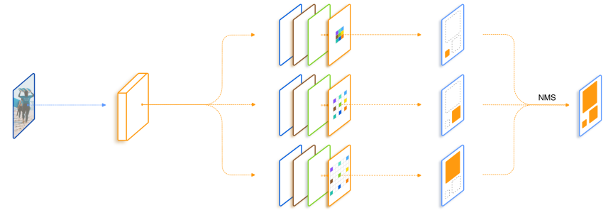

### 基于GAN

#### 1、SOD-MTGAN: Small Object Detection via Multi-Task Generative Adversarial Network ECCV 2018

**标题：SOD-MTGAN：基于多任务生成对抗网络的小目标检测**

**方法介绍**：为了解决小目标检测问题，作者提出了一个端到端的多任务生成对抗网络(MTGAN)。在MTGAN中，生成器是一个超分辨网络，可以将小的模糊图像上采样为细节丰富的图像，并恢复详细信息以进行更准确的检测。判别器是一个多任务网络，它用真/假分数、目标类别分数和边界框回归偏移描述每个超分辨图像块。此外，为了使生成器恢复更多细节以便于检测，训练过程中判别器中的分类和回归损失会反向传播到生成器。

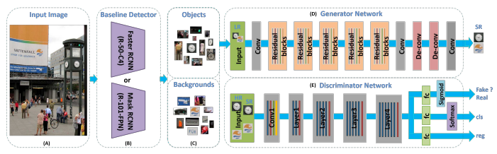

#### 2、Perceptual Generative Adversarial Networks for Small Object Detection CVPR 2017

**标题：小目标检测的感知生成对抗网络**

**方法介绍**：本文提出了一种内部将小目标表征“超分辨”提升的单一架构，使小目标达到类似大目标的特征，更有利于检测。为此，作者提出了感知对抗生成网络(Perceptual GAN)模型，通过缩小小目标与大目标的表征差异来提高小目标检测性能。其生成器学习将小目标较差的表征转化为类似真实大目标的超分辨表征，以迷惑对抗判别器。判别器则识别生成的表征，并要求生成的小目标表征对检测有利。

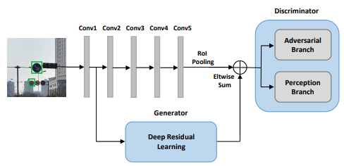

#### 3、Better to Follow, Follow to Be Better: Towards Precise Supervision of Feature Super-Resolution for Small Object Detection ICCV 2019

**标题：更好的跟随，跟随才能更好：为小目标检测实现特征超分辨的精确监督**

**方法介绍**：作者研究如何专门为小目标检测改进特征级超分辨率，并发现通过以下两点可以显著改进其性能：(i)利用适当的高分辨率目标特征作为SR模型训练的监督信号，(ii)匹配输入低分辨率特征和目标高分辨率特征的相对感受野。作者提出了一种新颖的特征级超分辨率方法，不仅正确地解决了这两个要求，而且可与任何基于proposal的检测器的特征池化相结合。在实验中，该方法显著提高了Faster R-CNN在清华大学-腾讯100K、PASCAL VOC和MS COCO三个基准测试上的性能。

### 基于Context信息

#### 1、PyramidBox: A Context-assisted Single Shot Face Detector

**标题：基于上下文的单次人脸检测器 PyramidBox**

**方法介绍**：本文提出了一种新颖的利用上下文信息的单次检测面部检测器PyramidBox来处理这一棘手问题。观察到上下文信息的重要性，作者从以下三个方面改进了上下文信息的利用。首先，作者设计了一种新颖的上下文锚框，通过半监督方法监督高层上下文特征学习，称为PyramidAnchors。其次，作者提出了低层特征金字塔网络，将充分的高层上下文语义特征和低层面部特征组合起来，这也使PyramidBox可以在单次检测中预测所有尺度的人脸。第三，作者引入了一个上下文敏感结构来增加预测网络的容量，以提高最终输出的准确性。此外，作者使用Data-anchor-sampling方法在不同尺度上增强训练样本，这增加了较小人脸的训练数据多样性。

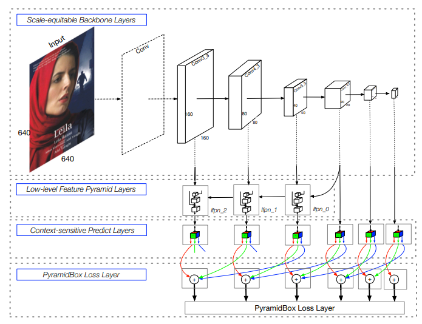

#### 2、Relation Networks for Object Detection

**标题：用于目标检测的关系网络**

**方法介绍**：本工作提出了一个对象关系模块。它通过对象外观特征和几何结构之间的交互同时处理一组对象，从而允许建模它们之间的关系。该模块轻量级且内置。它不需要额外的监督，并且很容易嵌入到现有网络中。结果表明，它可以有效改进现代目标检测流水线中的对象识别和重复删除步骤。它验证了在基于CNN的检测中建模对象关系的有效性，产生了第一个完全端到端的目标检测器。

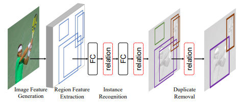

#### 3、Inside-Outside Net: Detecting Objects in Context with Skip Pooling and Recurrent Neural Networks CVPR 2016

**标题：内外网：使用跳过池化和递归神经网络检测上下文中的对象**

**方法介绍**：众所周知，上下文和多尺度表示对精确的视觉识别非常重要。在本文中，作者提出了内外网(ION)，这是一种利用感兴趣区域内外信息的目标检测器。使用空间递归神经网络集成感兴趣区域外的上下文信息。在内部，作者使用跳过池化在多个尺度和抽象级别上提取信息。通过大量的实验，作者评估了设计空间，并为读者提供了对重要技巧的概述，ION将PASCAL VOC 2012目标检测的最先进技术从73.9%提高到76.4% mAP。

### 基于Data

#### 1、Stitcher: Feedback-driven Data Provider for Object Detection CVPR 2020

**标题：Stitcher：面向对象检测的反馈驱动数据提供者**

**方法介绍**：目标检测器的质量通常会根据尺度变化，其中对小目标的性能最不满意。在本文中,，作者研究了这一现象，并发现：在大多数训练迭代中，小目标对总损失的贡献几乎可以忽略不计，导致不平衡优化的糟糕性能。受此发现的启发，作者提出了Stitcher，这是一个反馈驱动的数据提供者，其目的是以平衡的方式训练目标检测器。在Stitcher中，图像被调整为较小的组件，然后被拼接成与常规图像大小相同。拼接图像包含不可避免的较小目标，这将有利于我们的核心思想，利用损失统计作为反馈来指导下一迭代的更新。

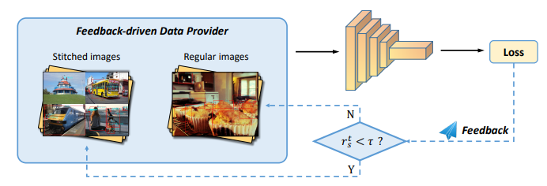

#### 2、Augmentation for small object detection CVPR 2019

**标题：小目标检测的数据增强**

**方法介绍**：作者在一个具有挑战性的数据集MS COCO上分析了当前最先进的模型Mask R-CNN。作者发现小真值目标与预测锚框之间的重叠远低于期望的IoU阈值，推测这是由于两个因素造成：(1)只有少数图像包含小目标，(2)即使在包含小目标的图像中，小目标的出现也不够多。因此，论文提出过采样那些包含小目标的图像，并通过多次复制粘贴小目标来增强每张图像。这使我们可以在大目标检测质量与小目标检测质量之间进行权衡。作者评估了不同的粘贴增强策略，最终相对于MS COCO上当前最先进的方法，该方法在小目标的实例分割上取得了9.7%的相对改进，目标检测上取得了7.1%的改进。

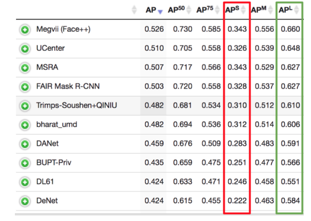

### 特殊训练策略

#### 1、An Analysis of Scale Invariance in Object Detection – SNIP CVPR 2018

**标题：尺度不变性在目标检测中的分析 - SNIP**

**方法介绍**：本文分析了不同的技术用于识别和检测存在极端尺度变化的对象。通过使用不同的输入数据配置训练检测器，比较了尺度特定和尺度不变的检测器设计。通过评估不同网络架构在ImageNet上分类小对象的性能，作者表明CNN对尺度变化并不稳健。基于这一分析，作者提出在图像金字塔的同一尺度上训练和测试检测器。由于小对象和大对象在较小和较大的尺度难以识别，作者提出了一种新颖的训练方案，称为图像金字塔的尺度归一化(SNIP)，它根据图像尺度选择性地反向传播不同大小的对象实例的梯度。

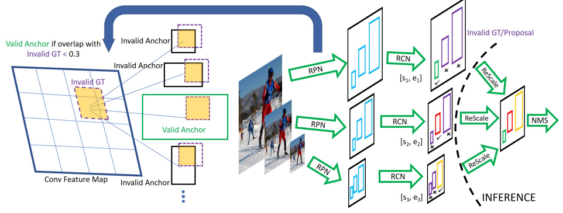

#### 2、SNIPER: Efficient Multi-Scale Training NIPS 2018

**标题：SNIPER：高效的多尺度训练**

**方法介绍**：作者提出了基于区域的全卷积网络，用于准确高效的目标检测。与以往的基于区域的检测器如Fast/Faster R-CNN不同，它们对每个区域都应用一个代价高昂的子网络数百次，基于区域的检测器是全卷积的,几乎全部计算在整个图像上共享。为达到这个目标，作者提出了位置敏感的分数图，以解决图像分类中平移不变性与目标检测中平移变异性之间的困境。因此该方法可以自然地采用最新的残差网络(ResNet)等全卷积图像分类器作为目标检测的backbone。

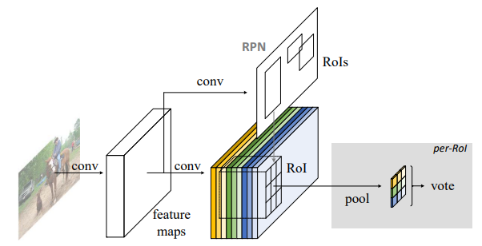

#### 3、R-FCN: Object Detection via Region-based Fully Convolutional Networks

**标题：R-FCN：基于区域的全卷积网络用于目标检测**

**方法介绍**：作者提出了SNIPER算法，用于在实例级视觉识别任务中进行高效的多尺度训练。SNIPER不是处理图像金字塔中的每个像素，而是在适当的尺度上处理真值实例周围的上下文区域(称为chips)。对于背景采样，这些上下文区域是使用经过短学习计划训练的区域建议网络提取的建议生成的。因此，在训练期间每个图像生成的chips数量会根据场景复杂性自适应变化。

由于SNIPER在重采样的低分辨率chips(512x512像素)上运行，即使采用ResNet-101 backbone，它在单GPU上的batch size也可以大到20。因此，它可以在训练期间从batch normalization中受益，而不需要跨GPU同步batch normalization统计数据。

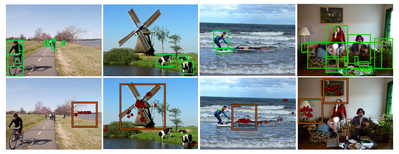

#### 4、SAN: Learning Relationship between Convolutional Features for Multi-Scale Object Detection

**标题：SAN：学习卷积特征之间的关系进行多尺度目标检测**

**方法介绍**：最近在准确目标检测中取得成功的大多数方法都是基于卷积神经网络(CNN)。然而，由于CNN检测方法中缺乏尺度标准化，不同尺度下激活的特征通道可能完全不同，这使分类器难以学习样本。作者提出了感知尺度网络(SAN)，它将不同尺度的卷积特征映射到尺度不变的子空间，使基于CNN的检测方法对尺度变化更具鲁棒性。作者还构建了一种独特的学习方法，纯粹考虑通道之间的关系而不包含空间信息，用于有效学习SAN。

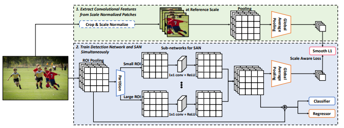
